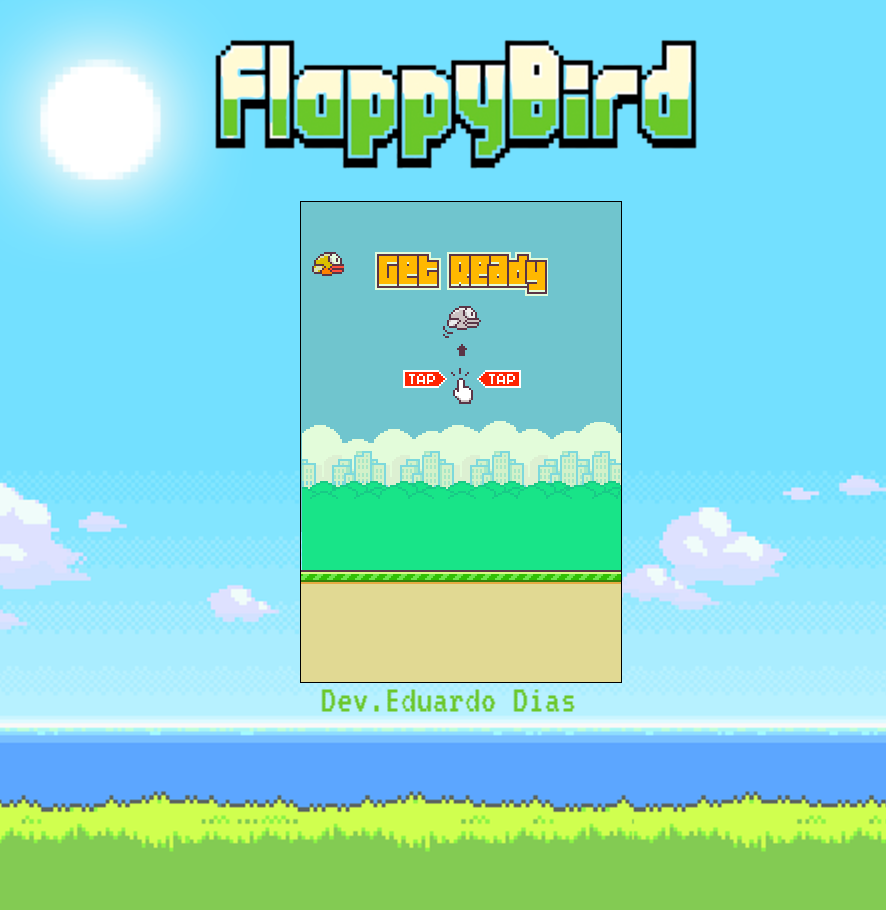
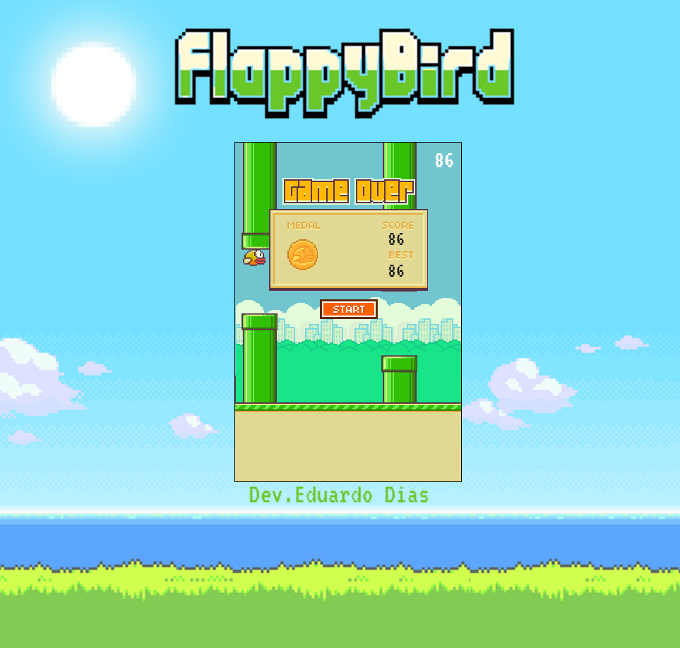

# Flappy Bird

 
<i>Dedico esse projeto à minha filhota Arya e minha esposa Sara!</i>  

## 💻 Sobre

Desenvolvido por <b>Eduardo Dias</b>, o projeto é uma recriação do jogo Flappy Bird feito a partir dos <a href="https://www.youtube.com/watch?v=jOAU81jdi-c&list=PLTcmLKdIkOWmeNferJ292VYKBXydGeDej">vídeos</a> do canal DevSoutinho, com algumas alterações e implementações adicionais.   

## 🛠 Tecnologias

  

## ⚙ Status:

:heavy_check_mark: Tela de início
 
:heavy_check_mark: Tela de Game Over
  
:heavy_check_mark: Efeitos sonoros: colisão, pulo, atravessar obstáculo.

:heavy_check_mark: Melhor pontuação com medalha.

:hammer: Seleção de dificuldade

:hammer: Seleção de personagem

:hammer: Surpresa ao atingir pontuação X.

:hammer: Organização do código em módulos.

 

##  :video_game: Demo do jogo

  :video_game: &nbsp;&nbsp;  <a align="center" href="https://eduardoazvdias.github.io/flappybird/"><i><b>ACESSE O JOGO AQUI</a> &nbsp;&nbsp;   :video_game:</b></i>

  
  

  

  

